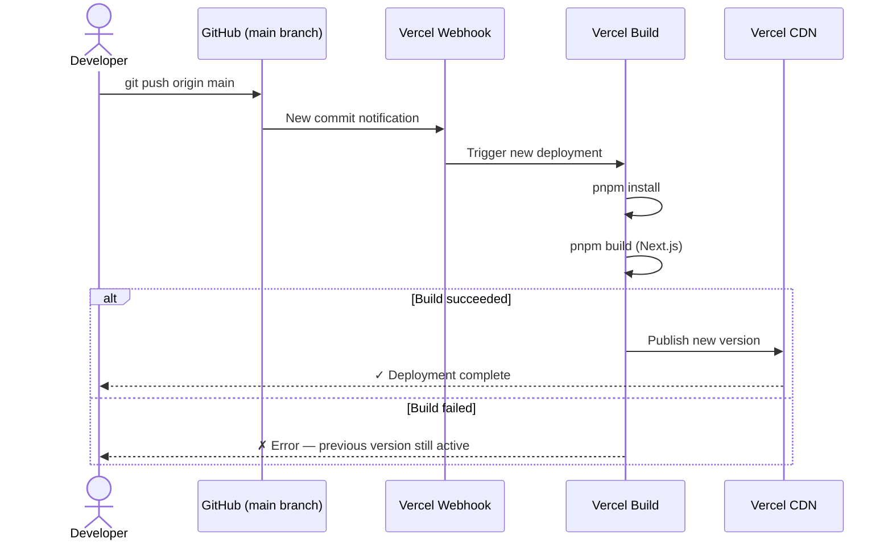
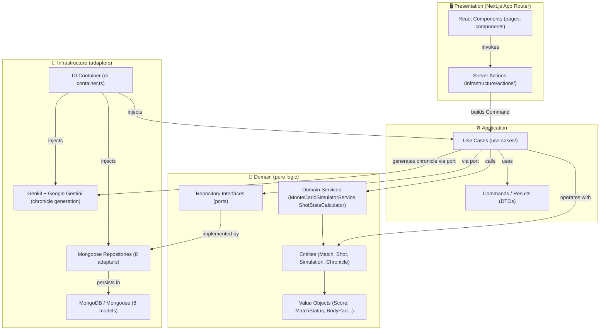
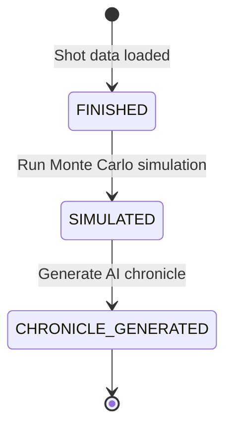
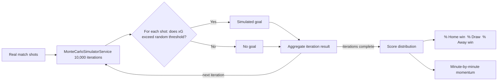
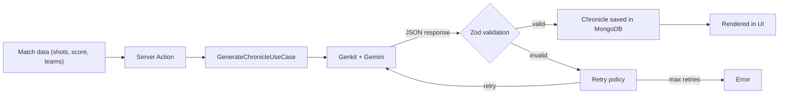
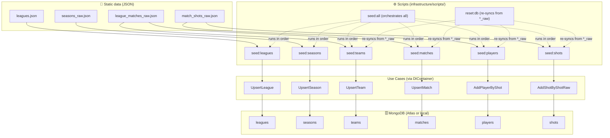

# SimuMatch Montecarlo AI

## Overview

SimuMatch Montecarlo AI is a football match sports analytics web application. It combines real shot data (shots and expected goals / xG) with Monte Carlo simulation to predict probable outcomes, and automatically generates narrative match chronicles using artificial intelligence (LLM models).

The project allows users to browse leagues and seasons, review detailed shot statistics per match, run probabilistic simulations on real data, and obtain AI-generated narrative reports describing how each match unfolded.

---

## Tech stack

| Category                   | Technologies                                                                   |
| -------------------------- | ------------------------------------------------------------------------------ |
| Main framework             | Next.js 16, React 19, TypeScript 5                                             |
| Database                   | MongoDB, Mongoose 9                                                            |
| AI / LLM                   | Google Genkit 1.29, Google Gemini                                              |
| Styling                    | Tailwind CSS 4                                                                 |
| Charts                     | Recharts 3                                                                     |
| Internationalisation       | next-intl 4                                                                    |
| Unit & integration testing | Vitest 4, Testing Library (React, user-event, jest-dom), mongodb-memory-server |
| E2E testing                | Playwright 1.58                                                                |
| Code quality               | ESLint 9 (SonarJS, typescript-eslint, jsx-a11y, import), Prettier 3            |
| Git hooks                  | Husky 9, lint-staged 16                                                        |
| Package manager            | pnpm                                                                           |
| Runtime utilities          | tsx 4, ts-node 10, dotenv 17                                                   |

---

## Installation and setup

### Prerequisites

- Node.js (version compatible with Next.js 16)
- pnpm
- MongoDB (local or remote instance). A `docker-compose.yml` is included to spin up MongoDB locally with Docker
- Docker (optional, only needed if you want to run MongoDB locally with the included docker-compose)
- Google AI API key (required for chronicle generation)

### Environment variables

Create a `.env` file at the project root with the following variables:

```env
MONGODB_URI=mongodb://localhost:27020
MONGODB_NAME=simumatch
MONGODB_MAX_POOL_SIZE=20           # optional, default: 20
GOOGLE_GENAI_API_KEY=your-api-key  # required for AI chronicle generation
GENKIT_CHRONICLE_MODEL=gemini-3.1-flash-lite-preview  # optional, default: gemini-3.1-flash-lite-preview
```

### Installation

```bash
pnpm install
```

### Start local MongoDB with Docker (optional)

If you don't have a MongoDB instance available, you can start one with the included `docker-compose.yml`:

```bash
pnpm db:start
```

This starts a MongoDB 7 container on port 27020 with a persistent volume.

To stop the local MongoDB container when you're done:

```bash
pnpm db:stop
```

### Seed the database

The `seed:all` script loads the entire database from scratch: it imports the raw data (JSON files included in the repository) and from them generates all domain model collections (leagues, seasons, teams, matches, players and shots).

```bash
pnpm seed:all
```

To reset the domain model collections (drop and re-populate from the already imported raw data):

```bash
pnpm reset:db
```

### Development

```bash
pnpm dev
```

The application will be available at `http://localhost:3000`.

### Production build

```bash
pnpm build
pnpm start
```

### Production deployment

Deployment is fully automated through the [Vercel](https://vercel.com) integration with the GitHub repository. Any push to the `main` branch automatically triggers a new production deployment with no manual intervention.

The process is as follows:

1. Push to the `main` branch of the remote GitHub repository: [github.com/smarcilla/simumatch-montecarlo-ai](https://github.com/smarcilla/simumatch-montecarlo-ai)
2. Vercel detects the new commit via a webhook configured on the repository.
3. Vercel clones the repository, installs dependencies (`pnpm install`) and runs the Next.js build (`pnpm build`).
4. If the build succeeds, Vercel publishes the new version and serves it through its global CDN.
5. If the build fails, the previous deployment remains active and Vercel reports the error.

The production application is available at: https://simumatch-montecarlo-ai.vercel.app/



### Testing scripts

| Command              | Description                                                      |
| -------------------- | ---------------------------------------------------------------- |
| `pnpm test`          | Run unit and integration tests with Vitest                       |
| `pnpm test:ui`       | Run tests with the Vitest visual UI                              |
| `pnpm test:coverage` | Run tests and generate coverage report                           |
| `pnpm test:e2e`      | Run end-to-end tests with Playwright (requires a running server) |

### Quality scripts

| Command             | Description                                          |
| ------------------- | ---------------------------------------------------- |
| `pnpm lint`         | Static analysis with ESLint and SonarJS              |
| `pnpm lint:fix`     | Automatically fix linting issues                     |
| `pnpm format`       | Format code with Prettier                            |
| `pnpm format:check` | Check formatting without modifying files             |
| `pnpm type-check`   | TypeScript type checking                             |
| `pnpm quality`      | Run lint + format:check + type-check + test:coverage |

---

## Project structure

The project follows a hexagonal architecture (clean architecture) with strict layer separation: domain, application and infrastructure.

```
src/
├── app/                          # Presentation layer (Next.js)
│   ├── layout.tsx                # Root layout
│   ├── page.tsx                  # Home page (match listing)
│   └── match/[id]/               # Dynamic match detail route
│       ├── page.tsx              # Match detail and shots
│       ├── simulation/page.tsx   # Monte Carlo simulation results
│       └── chronicle/page.tsx    # AI-generated chronicle
│
├── application/                  # Application layer (orchestration)
│   ├── commands/                 # Input DTOs (Commands)
│   ├── results/                  # Output DTOs (Results)
│   ├── use-cases/                # Use cases (22 use cases)
│   ├── ports/                    # Interfaces for external services
│   ├── options/                  # Filtering and pagination options
│   └── constants/                # Application layer constants
│
├── domain/                       # Domain layer (pure business logic)
│   ├── entities/                 # Domain entities (Match, Shot, Simulation, Chronicle, etc.)
│   ├── repositories/             # Repository interfaces (ports)
│   ├── services/                 # Domain services (MonteCarloSimulatorService, ShotStatsCalculator)
│   ├── value-objects/            # Immutable value objects (Score, MatchStatus, BodyPart, etc.)
│   └── types/                    # Shared domain types
│
├── infrastructure/               # Infrastructure layer (adapters)
│   ├── actions/                  # Next.js Server Actions (input adapters)
│   ├── db/                       # MongoDB configuration and Mongoose models
│   │   ├── client.ts             # MongoDB connection singleton
│   │   ├── connection-manager.ts # Connection lifecycle management
│   │   └── models/               # Mongoose schemas and models (8 models)
│   ├── repositories/             # Repository implementations with Mongoose (8 adapters)
│   ├── llm/                      # Genkit and Google Gemini integration
│   │   ├── genkit-chronicle.generator.ts  # Chronicle generation adapter
│   │   ├── genkit-chronicle.prompt.ts     # Model and prompt configuration
│   │   ├── chronicle.schemas.ts           # Zod output validation schemas
│   │   └── prompts/chronicle.prompt       # Prompt template
│   ├── mappers/                  # Mappers between entities and DB models
│   ├── retries/                  # Retry policies for AI operations
│   ├── errors/                   # Custom error classes
│   ├── scripts/                  # Seed and database management scripts
│   │   └── data/                 # Master league data in JSON format for seeding
│   ├── di-container.ts           # Dependency injection container
│   └── ui/                       # UI components and utilities
│       ├── components/           # React components (charts, tables, filters)
│       ├── layout/               # Shared layout (Header, Sidebar, Footer)
│       └── i18n/                 # Internationalisation config and messages (es/en)
│
├── tests/                        # Unit and integration tests
│   ├── setup/                    # Vitest and mongodb-memory-server configuration
│   ├── application/use-cases/    # Use case tests
│   ├── domain/                   # Entity, service and value object tests
│   ├── infrastructure/           # Adapter tests
│   ├── ui/components/            # React component tests
│   └── helpers/                  # Builders and test utilities
│
e2e/                              # End-to-end tests with Playwright
├── pages/                        # Page Objects (HomePage, MatchDetailPage, SimulationPage, ChroniclePage)
└── tests/                        # E2E scenarios (navigation, simulation, chronicles)
```

### Data flow

The flow follows the hexagonal architecture pattern:

1. **Input**: Next.js Server Actions (`infrastructure/actions/`) receive client requests, validate them and transform them into application layer Commands.
2. **Orchestration**: Use Cases (`application/use-cases/`) coordinate the logic using domain repositories and services.
3. **Domain**: Domain Entities and Services (`domain/`) execute the pure business logic (Monte Carlo simulation, statistics calculation).
4. **Output**: Results are returned as application DTOs and rendered in the React components of the presentation layer.

### Architecture diagram



---

## Key features

### 1. Match browsing and querying

The application allows users to browse leagues and seasons to consult historical matches. Each match shows detailed information about the shots taken, including:

- Player who took the shot
- Expected goals (xG) of the shot
- Shot type (header, foot, etc.)
- Shot situation (open play, counter-attack, set piece, etc.)
- Shot outcome (goal, saved, off target, etc.)

Matches go through three states: `FINISHED` (data loaded), `SIMULATED` (simulation run) and `CHRONICLE_GENERATED` (chronicle generated). The application includes filters by date, season and match status, as well as pagination for list navigation.



### 2. Monte Carlo simulation

The simulation engine runs 10,000 iterations over a match's real shot data to generate probabilistic predictions that abstract away randomness. Results include:

- **Score distribution**: Probability of each possible scoreline (e.g. 1-0, 2-1, 0-0, etc.)
- **Momentum points**: Minute-by-minute evolution of each team's win probability throughout the match
- **Outcome probabilities**: Percentage chance of home win, draw and away win

The simulation logic is implemented as a pure Domain Service (`MonteCarloSimulatorService`) with no external dependencies, following hexagonal architecture principles.



### 3. AI chronicle generation

Using Google Genkit and the Gemini model, the application automatically generates narrative match chronicles. The chronicle is structured as a validated JSON object containing:

- **Narrative sections**: Three match analysis blocks (pulse, turning-point, closing), each with 2–3 paragraphs of narrative text
- **Highlights**: Three key match moments with a team indicator (home/away/neutral)
- **Key stats**: Three notable statistical data points
- **Timeline**: Match events with minute indicator (e.g. 47')

Generation includes retry policies to handle transient LLM errors and strict output validation via Zod schemas.



### 4. Initial data loading

The project includes a set of ingestion scripts located in `src/infrastructure/scripts/` that populate the database collections from static JSON files bundled in the repository (`data/`).

The scripts are **completely agnostic to the MongoDB instance**: they connect via the `MONGODB_URI` environment variable, so they work identically against a local Docker instance, a self-hosted instance or the database hosted on MongoDB Atlas. Configuring the `.env` file is all that is needed.

#### Data sources

| JSON file                 | Target collection    |
| ------------------------- | -------------------- |
| `leagues.json`            | `leagues`            |
| `seasons_raw.json`        | `seasons_raw`        |
| `league_matches_raw.json` | `league_matches_raw` |
| `match_shots_raw.json`    | `match_shots_raw`    |

#### Synchronisation process

The scripts do not write directly to the database: they invoke **use cases** through the dependency injection container (`DIContainer`), respecting the hexagonal architecture. Each use case receives a `Command` with the JSON data and performs an upsert operation on the corresponding domain collection.

The execution order matters due to dependencies between collections:

1. `seed:leagues` — syncs leagues from `leagues.json`
2. `seed:seasons` — syncs seasons from `seasons_raw.json`
3. `seed:teams` + `seed:matches` — syncs teams and matches from `league_matches_raw.json`
4. `seed:players` + `seed:shots` — syncs players and shots from `match_shots_raw.json`

The `seed:all` script runs all of the above steps in the correct order in a single call. The `reset:db` script re-syncs only the derived domain collections (teams, matches, players and shots) from the already-imported `*_raw` collections, without needing to reload the JSON files.



---
